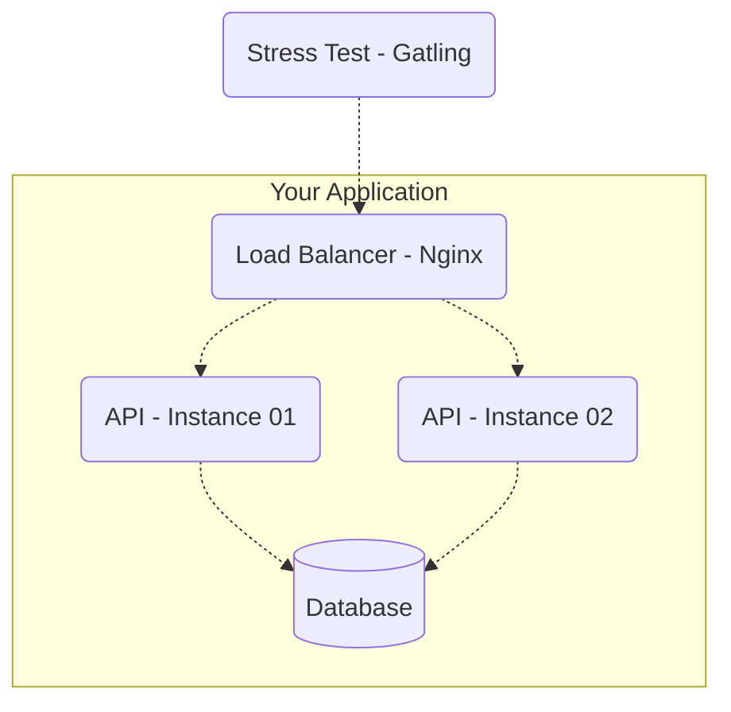

## Solution for 'Rinha Backend 2023'

Rinha backend was a [brazilian competition](https://github.com/zanfranceschi/rinha-de-backend-2023-q3?tab=readme-ov-file) with the following description:

```
From July 28th to August 25th, the Backend Fight was held, a tournament in which the API that supported the most load during a stress test would be the winner. Participants had to implement an API with endpoints to create, query and search for a 'person' (a kind of CRUD without UPDATE and DELETE). In the tournament, participants still had to deal with CPU and memory restrictions – each participant had to deliver the API in docker-compose format and could only use 1.5 CPU units and 3GB of memory.
```

Some useful information that the community discovered some time after the challenge was completed and with extensive tests:
...loading

### Instructions for the challenge

Here an english translation for the challenge

#### Resume

- APIs must expose the same endpoints and necessarily use one of the following databases (of your choice): Postgres, MySQL, or MongoDB.
- The API "deployment" will be done via docker-compose with CPU and memory limits.
- The test will be run on properly configured EC2 and the CPU and memory limitations will be interesting for us to exercise environments with limitations, use creativity;
- The Gatling tool will be used to run the stress tests.
- The essence of this tournament is not the competition itself (even because whoever wins doesn't win anything lol), but sharing knowledge.

#### Endpoints

APIs need to expose 3 (4, actually) endpoints:

- `POST /person` – to create a person resource.
- `GET /person/[:id]` – to query a resource created with the previous request.
- `GET /person?t=[:search term]` – to search for a person.
- `GET /count-person – special` – endpoint for counting registered person.

##### Person creation
`POST /person`

You must accept a request in JSON format with the following parameters:

| attribute | description |
| --- | --- |
| **nickname** | mandatory, unique, string of up to 32 characters. |
| **name** | mandatory, string of up to 100 characters. |
| **birth** | mandatory, date string in YYYY-MM-DD format (year, month, day). |
| **stack** | optional, string vector with each element being mandatory and up to 32 characters. |

For valid requests, your API must return status code 201 - created along with the header "Location: /pessoas/[:id]" where [:id] is the id – in UUID format with the version at your discretion – of the person who has just been created. The contents of the body are at your discretion; return whatever you want.

Valid requests example:
```json
{
    "nickname" : "josé",
    "name" : "José Roberto",
    "birth" : "2000-10-01",
    "stack" : ["C#", "Node", "Oracle"]
}
```

```json
{
    "nickname" : "ana",
    "name" : "Ana Barbosa",
    "birth" : "1985-09-23",
    "stack" : null
}
```

For invalid requests, the status code must be 422 - Unprocessable Entity/Content. Here again, the body content is at your discretion.

Invalid requests example
```json
{
    "nickname" : "josé", // in case this name exists already
    "name" : "José Roberto",
    "birth" : "2000-10-01",
    "stack" : ["C#", "Node", "Oracle"]
}
```

```json
{
    "nickname" : "ana",
    "name" : null, // cant be null
    "birth" : "1985-09-23",
    "stack" : null
}
```

```json
{
    "nickname" : null, // cant be null
    "name" : "Ana Barbosa",
    "birth" : "1985-01-23",
    "stack" : null
}
```

In the case of syntactically invalid requests, the response must have a status code of 400 - bad request. Examples:

```json
{
    "nickname" : "apelido",
    "name" : 1, // name should be string, not number
    "birth" : "1985-01-01",
    "stack" : null
}
```

```json
{
    "nickname" : "apelido",
    "name" : "name",
    "birth" : "1985-01-01",
    "stack" : [1, "PHP"] // stack should be an string only array
}
```

##### Person details
`GET /person/[:id]`

It must return the details of a person if it was previously created. The [:id] parameter must be of type UUID in the version you choose. The return should be like the following examples:

```json
{
    "id" : "f7379ae8-8f9b-4cd5-8221-51efe19e721b",
    "nickname" : "josé",
    "name" : "José Roberto",
    "birth" : "2000-10-01",
    "stack" : ["C#", "Node", "Oracle"]
}
```

```json
{
    "id" : "5ce4668c-4710-4cfb-ae5f-38988d6d49cb",
    "nickname" : "ana",
    "name" : "Ana Barbosa",
    "birth" : "1985-09-23",
    "stack" : null
}
```

Note that the response is practically the same as the creation payload with the addition of `id`. The status code for people that exist must be 200 - Ok. For resources that do not exist, 404 - Not Found must be returned.

##### Search for people
`GET /person?t=[:search term]`

Given the search term, the response should be a list that satisfies the term being contained in the attributes nickname, name, and/or elements of stack. The search does not need to be paginated and may return only the first 50 records resulting from the filtering to facilitate implementation.

The status code should always be 200 - Ok, even in cases where the search returns no results (empty).

Examples: Given the following existing resources in your application:

```JSON
[{
    "id" : "f7379ae8-8f9b-4cd5-8221-51efe19e721b",
    "nickname" : "jose",
    "name" : "José Roberto",
    "birthdate" : "2000-10-01",
    "stack" : ["C#", "Node", "Oracle"]
},
{
    "id" : "5ce4668c-4710-4cfb-ae5f-38988d6d49cb",
    "nickname" : "ana",
    "name" : "Ana Barbosa",
    "birthdate" : "1985-09-23",
    "stack" : ["Node", "Postgres"]
}]
```

A GET /person?t=node request should return the following:

```JSON
[{
    "id" : "f7379ae8-8f9b-4cd5-8221-51efe19e721b",
    "nickname" : "jose",
    "name" : "José Roberto",
    "birthdate" : "2000-10-01",
    "stack" : ["C#", "Node", "Oracle"]
},
{
    "id" : "5ce4668c-4710-4cfb-ae5f-38988d6d49cb",
    "nickname" : "ana",
    "name" : "Ana Barbosa",
    "birthdate" : "1985-09-23",
    "stack" : ["Node", "Postgres"]
}]
```

A GET /person?t=berto request should return the following:

```JSON
[{
    "id" : "f7379ae8-8f9b-4cd5-8221-51efe19e721b",
    "nickname" : "jose",
    "name" : "José Roberto",
    "birthdate" : "2000-10-01",
    "stack" : ["C#", "Node", "Oracle"]
}]
```

A GET /people?t=Python request should return the following:
```JSON
[]
```

If the query string t is not provided, the response should have a 400 - bad request status code with the body of your choice. In other words, providing t is mandatory

##### Count of People - Special Endpoint

`GET /people-count`

This is a special endpoint that WILL NOT BE TESTED (so don't worry about its performance) and should return in plain text the number of people records and any status code in the 2XX range. It will be used to validate the number of successful creation requests during the stress test, so do not use cache or any other form of eventual consistency storage.

##### Important Note About Cache and Storage

You may use cache, but eventually, all records created through POST /people requests need to be persisted in non-volatile (disk) database storage.


#### Component Restrictions
The test will have the following components and topology:



#### Load Balancer - Nginx
The load balancer is included in the test to simulate a production environment with more than one API instance for greater availability.

#### API - Instances 01 and 02
As mentioned, the test will be executed with two instances of your API. Besides being slightly less distant from a production environment, having more than one instance forces you to think more carefully about cache, consistency, etc. The balancing strategy for your APIs will be round-robin or fair distribution. That is, the first request will go to API 01, the second to API 02, the third to API01 again, and so on.

#### Database
As mentioned at the beginning of the document, you can choose to use Postgres, MySQL, or MongoDB. It's up to you :)

#### Instructions for Setting Up/Preparing Your Application
The following needs to be configured to participate in the tournament. If you have difficulty with any of the items, feel free to tag me on Twitter with your questions at @zanfranceschi.

#### docker-compose File
Your application will be tested in containers with docker-compose through port 9999. Below is an example of what your docker-compose.yml file should look like:

```yml
version: '3.5'
services:
  api1: # API - Instance 01
    image: api
    hostname: api1
    depends_on:
      - db
    expose:
      - "80"
    deploy:
      resources:
        limits:
          cpus: '0.25'
          memory: '0.5GB'

  api2: # API - Instance 01
    image: api
    hostname: api2
    depends_on:
      - db
    expose:
      - "80"
    deploy:
      resources:
        limits:
          cpus: '0.25'
          memory: '0.5GB'

  nginx: # Load Balancer
    image: nginx:latest
    volumes:
      - ./nginx.conf:/etc/nginx/nginx.conf:ro
    depends_on:
      - api1
      - api2
    ports:
      - "9999:9999"
    deploy:
      resources:
        limits:
          cpus: '0.25'
          memory: '0.5GB'

  db: # Database
   image: postgres
   deploy:
      resources:
        limits:
          cpus: '0.75'
          memory: '1.5GB'
   # ...
   ...
```

<b>IMPORTANT:</b> You have 1.5 CPUs and 3.0GB to distribute as you wish among your containers! The limits shown here are just an example – use them as you wish. Learning to deal with constraints is very important! :)

Perhaps the part about Nginx, round-robin, etc was not very clear to you. Below is an example of how you could configure the file `nginx.conf` so that requests are distributed between the two instances of your API. Note that the `volume` declaration of the nginx service in the docker-compose.yml file points to a custom configuration file located in the same directory as docker-compose.yml. Use the section below as a reference:

```nginx
events {
    # configure as you wish
}
http {
    upstream api {
        server api1:80;
        server api2:80;
    }
    server {
        listen 9999;
        location / {
            proxy_pass http://api;
        }
    }
}
```
